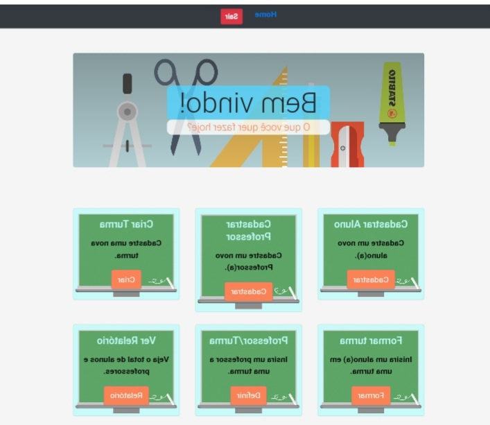
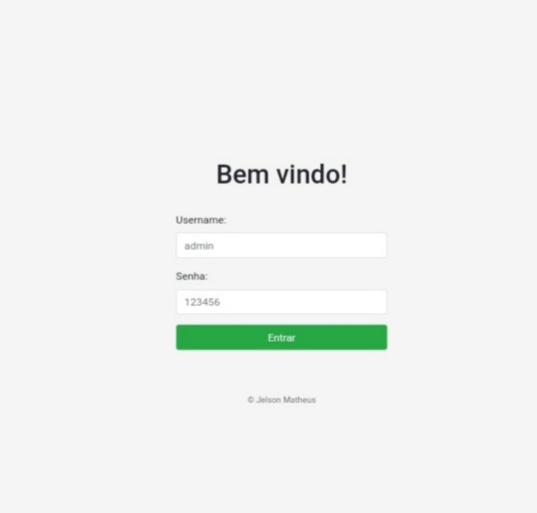

# Desafio Infatec - 2021
Home Page | Tela login
--------- | -----------
 | 

<br>
Sistema para gestão escolar no qual poderá realizar
cadastro de alunos, professores, turmas e gerar relatórios.

## Tecnologias usadas:
* Html
* CSS, Bootstrap
* javascript
* Python, Django

## Instalação e  Executando:
* Dependências Django v3.1.7
* Na pasta *escola* rodar o comando:<br>
`python manage.py runserver`
* Realizar o login no sistema:
  * login: __admin__
  * Senhar: __123456__

## Dados Pre-cadastrados:
* Superuser: admin
* Escola: Escola Programação Django
* Series: 1°, 2°, 3°, 4°, 5°, 6°, 7°, 8° e 9°

## Dados cadastrados pelo sistema
#### Aluno
* Leandro da Silva - 1 °
* joão da Silva João - 1°
* Maria da Silva Maria - 1°
* Carlos Araujo João - 1°
* Carlos da Silva - 2°
* Ana Maria julia - 2°
* Alvem João - 2°
* Beatriz da Silva - 3°
* Pedro da Silva - 3° 

#### Professores:
* Prof João Cardoso
* Prof Marcos Cardoso
* Prof Maria Cardoso
* Prof Pedro Araujo
* Prof Juliana Araujo
* Prof Osvaldo da Silva 

#### Turmas:
* 1 A
* 1 B
* 2 A
* 2 B
* 3 A
* 3 B
* 1/2/3 A
* 1/2/3 C

## Path para consulta de dados:
#### `/relatorio/consulta-alunos/`:
Returna um **json** que contém uma lista de objetos aluno:
```
aluno:
{
    'alunos': [
        {
            "nome" : "nome", 
            "serie" : "serie"
         }, 
     ]
}
```

#### `/relatorio/consulta-professores/`:<br>
retorna um **json** que contém uma lista de professores
```
{
    'professores': [
        {
            "nome'": "nome", 
            "turma": 'urma"
         }, 
     ]
}
```

#### `/relatorio/consulta-turma/ ` ou `/relatorio/consulta-turma/<serie_id>/`
```
retorna um **json** com uma lista de turmas:
{
     "turmas" : [
          {
              :nome" : "nome",
              "series" : [ ]
               'id' : "turma_id"
          },
      ]
}
```


