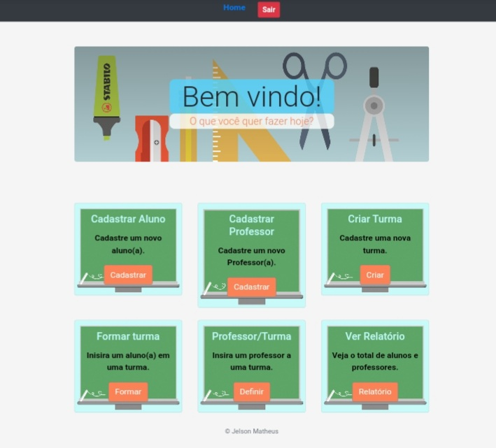

# Desafio Infatec - 2021
Home Page | Tela login
--------- | -----------
 | 

<br>
Sistema para gestão escolar no qual poderá realizar
cadastro de alunos, professores, turmas e gerar relatórios.

## Tecnologias usadas:
* Html
* CSS, Bootstrap
* javascript
* Python, Django


# Configurações:

Para rodar um servidor local Django e utilizar a aplicação será nescessario seguir as seguintes etapas.

1 - Criar o ambiente virtual para instalar as dependencias do projeto.
- **pyton -m venv venv**

2 - Ativar o ambiente virtual.
- windows -
- **venv\scripts\activate**

3 - Instalar as dependencias.
- **pip install -r .\requirements.txt**

Com as configurações de dependências feitas, no repositório do projetos
já existe um banco de dados **apenas** para teste com dados pre-cadastrados. 
Basta inicializar o servidor:
1 -- Iniciar servidor Django
- **python manage.py runserver**

2 -- O servidor será iniciado em localhost:8000
- Os path seguem apartir dai.

Caso não utilize o banco de dados, você deve seguir os procedimentos:
1 -- Realizar o makemigrations e migrate
- **python manage.py makemigrations**
- **python manage.py migrate***

2 -- Criar um superuser com nome adim:
- **python manage.py createsuperuser --username admin**
- **Email address: example@gmail.com**
- **Password: 123456**
- **Password(again): 123456**
- confirme se necessário.

3 -- Inicializar seguindo os passos já descritos.

4 -- Realizar o login e acessar path /admin/
- **Realize o cadastros de uma escola e series manualmente pelo Django admin.**

5 -- A partir daí você pode voltar a página principal da aplicação.

## Path para consulta de dados:
##### /relatorio/consulta-alunos/
Returna um **json** que contém uma lista de objetos aluno:
```
aluno:
{
    'alunos': [
        {
            "nome" : "nome", 
            "serie" : "serie"
         }, 
     ]
}
```

##### /relatorio/consulta-professores/
retorna um **json** que contém uma lista de professores
```
{
    'professores': [
        {
            "nome'": "nome", 
            "turma": 'urma"
         }, 
     ]
}
```

##### /relatorio/consulta-turma/ ou /relatorio/consulta-turma/<serie_id>/
retorna um **json** com uma lista de turmas:
```
{
     "turmas" : [
          {
              :nome" : "nome",
              "series" : [ ]
               'id' : "turma_id"
          },
      ]
}
```

## Observações:
1 -- Os dados no banco de dados são todos fictícios e devem usar usados
Apenas para testes.


